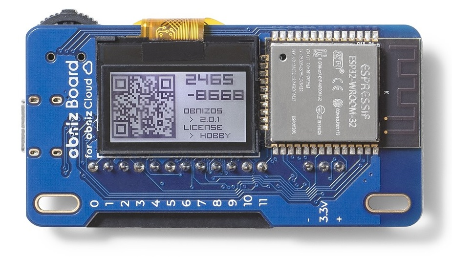
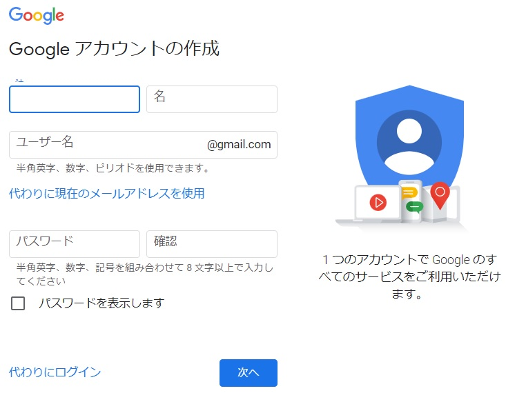

## センサを活用したIoTアプリケーション開発技術

#  目次
#### 第１章　obniz入門
- [はじめに](#はじめに)

#### 第２章　obniz のプログラミング
- 2-1 [開発環境への接続（コードエディタ）](https://github.com/TechnoIR63/seminar-obniz/blob/main/chap02_1.md)
- 2-2 [obnizのユーザアカウントの作成](https://github.com/TechnoIR63/seminar-obniz/blob/main/chap02_2.md)
- 2-3 [obnizに実装されている電子部品](https://github.com/TechnoIR63/seminar-obniz/blob/main/chap02_3.md)
- 2-4 [電子部品（センサ等）の接続](https://github.com/TechnoIR63/seminar-obniz/blob/main/chap02_4.md)
 - 2-4-1 [◎二つの電子部品を連携させたプログラミング](https://github.com/TechnoIR63/seminar-obniz/blob/main/chap02_4.md)
 - 2-4-2 [◎自作センサ回路部品のプログラミング](https://github.com/TechnoIR63/seminar-obniz/blob/main/chap02_6.md)

#### 第３章　Webサービスとの連携
- 3-1 [Ambient（IoTデータの可視化サービス）](https://github.com/TechnoIR63/seminar-obniz/blob/main/chap03_1.md)
- 3-2 [IFTTT（イフト）](https://github.com/TechnoIR63/seminar-obniz/blob/main/chap03_2.md)
- 3-3 [Machinist（マシニスト）](https://github.com/TechnoIR63/seminar-obniz/blob/main/chap03_3.md)
- 3-4 [Firebase（バックエンド提供サービス）](https://github.com/TechnoIR63/seminar-obniz/blob/main/chap03_0.md)
- **** [obnizのサーバーレスイベント](https://github.com/TechnoIR63/seminar-obniz/blob/main/chap03_0.md)

---

## 第１章　obniz入門
## はじめに
obnizは，オブナイズと読みます．[公式サイトの会社概要](https://obniz.io/ja/jobs)
を参照するとobniz（object + nize）とあり「現実に身の回りに存在するものをどんなに離れていてもどの種類のプログラムからでも "Object" として操作可能にすることが目標です」とあります．
 
そして，電子回路をInternet上でAPI化し，センサーやモーターがどこにあるか どの通信規格か
そういったことを意識せずに画面の中と外の区別なく１つのソフトウェアから操作可能であることが述べられています．
 
本セミナーでは，ホビーから産業まで利用拡大しているobnizについて，これらのことを体験していただき
IoTアプリケーション開発技術の知見を広げてもらえましたら幸いです．

## 使用デバイス
obniz Board 1Y(出典：https://obniz.com/ja/doc/reference/board-1y/)

    

使用するデバイスは，obniz Board 1Y  という型式の開発ボードで，最大1Aまで流せる12個の入出力ピンを搭載した開発ボードです．Wi-Fi経由で専用のクラウドに接続し，インターネット経由でobniz Board 1Y に接続された電子部品を操作します．この型式の開発ボードは，指定した時間やあるきっかけまで動作を停止するスリープ機能を搭載していますので，低消費電力状態で待機し，起動頻度にもよりますが電池のみで１年以上の稼働が可能です．

## メールアカウントの登録（Gmail）
購入した公式デバイスはobnizのアカウントに登録することで，次のような機能が利用できます．
- デバイスの管理
  - 複数台ある時のデバイスの説明文の追加や，接続履歴の確認，OTAなど
- リポジトリ
  - プログラムなどを保存する領域
- サーバレスイベント
  - プログラムをサーバ上で実行

 これらの機能を利用するためには，obnizのアカウントを作成する必要があります．また，アカウント作成にメールアドレスが必要になります．そこで，まず初めにGmailアドレスのアカウント登録作業をします．

 ### Gmail アカウントの作成
 1. [Google アカウント作成ページにアクセスします．](https://accounts.google.com/SignUp)

 

     
 

 2. 画面の手順に沿ってアカウントを設定します．
 3. 作成したアカウントでGmailにログインします．

 これで，メールアカウントの登録作業は終了です．

## obniz Board 1Y の起動とWi-Fi接続設定
[３つのステップ](https://obniz.com/ja/doc/reference/board-1y/quick-start/) で起動とWi-Fi設定を行います．

パスワード入力の文字並びは， 

END a b c d e f g h i j k l m n o p q r s t u v w x y z  
A B CD E F G H I J K L M N O P Q R S T U V W X Y Z  
0 1 2 3 4 5 6 7 8  speace _@ ! ? " ' # $ & ( ) [ ] { } + - * /
 = \ , . : ; < > ^ ~ | BACK
 
を繰り返します．

1. USBケーブルを使ってPCから給電します．USBを繋ぐと起動し，抜くと電源はOFFになります．
2. Boardが起動したならばWi-Fiの設定方法が示されます．ここでは，SIMPLE METHODを選んでください．
  - SSIDの値
  - パスワードの入力
3. プログラムの実行
  - パソコン（PC）を使用しますので，開発者コンソールの[プログラムエディタ](http://obniz.com/ja/console/program)を開きます．obnizIDを求められますのでBoardのディスプレイに表示されている８桁の数字を入力します．

  これで，obnizBoardの接続設定は終了です． 

（obnizのプログラミング）

  

      
  

